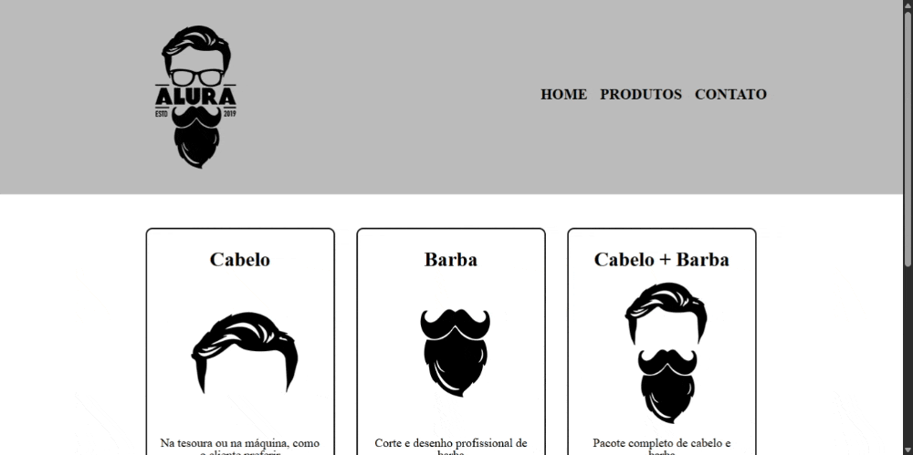

# 🪒 Barbearia Alura  

Projeto desenvolvido durante o primeiro módulo do curso de **HTML e CSS** da [Alura](https://www.alura.com.br), com o instrutor **Pedro Marins**.  

O objetivo foi aplicar conceitos básicos de **estruturação de páginas web** e **estilização com CSS**, criando um site fictício para a *Barbearia Alura*.  

---

## 📸 Demonstração  

  

---

## 📚 Aprendizados  

Durante o desenvolvimento, pratiquei:  

- Estrutura semântica em **HTML5**  
- Organização de conteúdo em seções (`<header>`, `<main>`, `<section>`, `<footer>`)  
- Uso de **classes e IDs** para estilização no CSS  
- Aplicação de listas, títulos hierárquicos e imagens  
- Separação entre **conteúdo (HTML)** e **estilo (CSS)**  

---

## 🛠️ Tecnologias Utilizadas  

- **HTML5**  
- **CSS3**  

---

# 🪒 Modulo 02

---

## 📸 Demonstração  

  

## 📚 Aprendizados  

- Estruturação de páginas com **HTML5**  
- Navegação entre páginas com `<nav>` e listas  
- Aplicação de **reset.css** para padronizar estilos  
- Criação de um **layout responsivo básico** usando `inline-block`  
- Uso de **hover** e **active** no CSS para interatividade  
- Estilização de listas e caixas com bordas, espaçamento e `border-radius`  
- Criação de um **rodapé personalizado** com imagem de fundo  

## 📌 Próximos Passos

- Aplicar conceitos de responsividade com media queries

- Criar uma página de contato com formulário funcional

---
